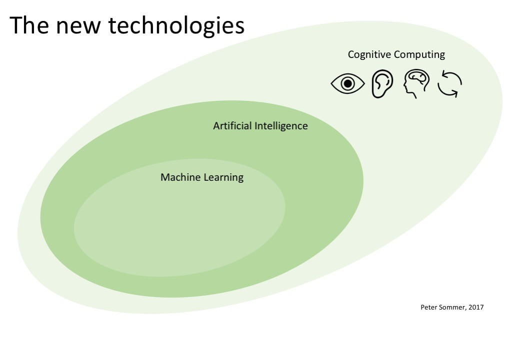
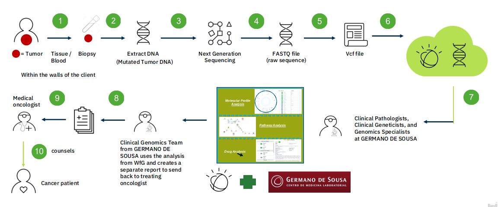
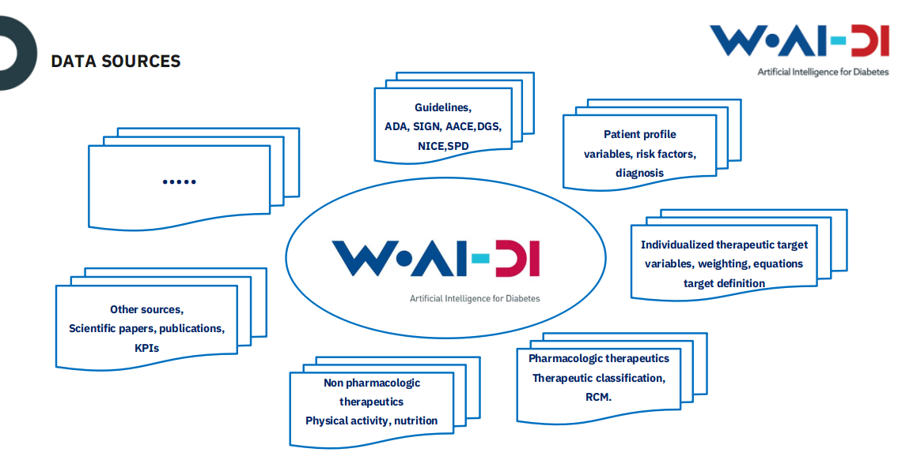

= Inteligência Artificial em Medicina e a investigação IBM Watson
:date: 24-May-2019
:slide-background-video: stars.webm
:_title-slide-background-image: cover_bg.png
:icons: font
:email: <frederico.munoz@pt.ibm.com>

[.location]
*Frederico Muñoz* | Chief Architect | IBM Technical Expert Council (SPGI)
Faculdade de Medicina da Universidade de Coimbra
Outubro 2020

[.big]
== Olá!

== !
image::https://avatars0.githubusercontent.com/u/285727?s=460&v=4[width="150", border="0"]

icon:envelope-o[] <frederico.munoz@pt.ibm.com>

icon:linkedin[] https://www.linkedin.com/in/fsmunoz/

icon:twitter[] https://twitter.com/fredericomunoz

icon:github[] https://github.com/fsmunoz

== Sobre o Technical Expert Council

O Technical Expert Council para Espanha, Portugal, Grécia e Israel é
um organismo afiliado da IBM Academy of Technology.

image::https://researcher.watson.ibm.com/researcher/images/aotlogo_100x100.png[width=20%,role=inline] 

[.bigger]
== História

O caminho que fizemos

[.big]
== através de momementos fundamentais da IBM Research nos campos da IA e Investigação Cognitiva

[.bigger]
== 1954

[.big]
== Mark I and Mark II Automatic Language Translators

[transition=zoom]
== !

* Tradução automática de Russo para Inglês, começando por 250 palavras e tradução de textos de química orgânica.
* Em 1960 o vocabulários é de 170 000 palavras em vários domínios.

== IBM Harvard Mark I
[.stretch]
video::SaFQAoYV1Nw[youtube, start=10, options=autoplay]

[.bigger]
== 1959

[.big]
== Arthur Lee Samuel

[background-image=https://www-03.ibm.com/ibm/history/ibm100/images/icp/A138918I23240Y22/us__en_us__ibm100__700_series__checkers__620x350.jpg]
== !

[.big]
== Checkers Player

== !

* Primeiro programa de Damas que demonstra a capacidade de um
  computador aprender através da experiência.

[.bigger]
== 1972

[.big]

== Robert Mercer

[background-image=https://researcher.watson.ibm.com/researcher/files/us-bbfinkel/robert_mercer.jpg]
== !

[.big]
== Reconhecimento de Voz Probabilístico

== !

* A IBM desenvolve a abordagem fundamental ao *reconhecimento de voz
  probabilístico* baseado em ideas da Teoria da Informação.

[.bigger]
== 1984

[.big]
== Reconhecimento de voz em tempo real

== !

* Primeira demonstração de reconhecimento de voz em tempo real com largo vocabulário.
* Avanço fundamental no reconhecimento de voz em termos de eficácia, precisão e validade do modelo.

  
[.bigger]
== 1997

[background-image=https://images.theconversation.com/files/168950/original/file-20170511-32613-1ipnlda.jpg?ixlib=rb-1.1.0&rect=0%2C49%2C2048%2C993&q=45&auto=format&w=1356&h=668&fit=crop]
[.big]
== Deep Blue Chess

Primeiro computador a derrotar um Campeão do Mundo de Xadrez, Garry Kasparov.

[.bigger]
== Em 2011, um passo fundamental

==  Watson and Jeopardy!

[background-iframe=https://www.youtube.com/embed/P18EdAKuC1U?autoplay=1]
== !

== !
[%step]
* Primeiro computador a derrotar campeões de Jeopardy!
* Utilizou mecanismos cognitivos para compreender, pesquisar, contruir uma resposta e exprimi-la.

== Mas... como funciona?

== E o que são estes componentes "cognitivos"?

[.bigger]
== Conceitos

AI, Machine Learning, Cognitive...

== !
[.stretch]

== Aprendizagem por máquinas

* Capacidade de computadores aprenderem com novos dados.
* Algoritmos que aprendem com dados e permitem estabelecer previsões
ou outras capacidade com base nessa aprendizagem.

== Inteligência Artificial

* Com base em informação, capacidade de tomar decisões e acções que
  melhor se adequem a um determinado contexto.

== Computação cognitiva

* Sistemas que interagem naturalmente com pessoas.

[transition=zoom, %notitle]
== Sistemas cognitivos são diferentes

[.step]
* Um nível superior de interacção humana.
* Capacidade de  aumentar o conhecimento.
* Adicionam capacidades cognitivas a soluções.
* Utilizam _processos cognitivos_
* Potenciam a exploração e descoberta.

== Sistemas cognitivos

«... Esta plataforma tem de incluir _machine learning_, raciocínio, processamento de linguagem, fala e visão, interacção homem-computador, diálogo e produção narrativa, entre outros...»
_- Kelly, J., 2015. *Computing, cognition and the future of knowing*. Whitepaper, IBM Reseach.
Vancouver._

[transition=zoom, %notitle]
[background-video="./stars.webm",options="loop,muted"]
== Cognitivo

* Dados -> Informação -> Conhecimento

== Computação cognitiva

[%step]
* Vai para _além_ da análise.
* É capaz de consumir e interpretar _informação não estruturada_.
* Endereça _problemas ambíguos_.
* Interage naturalmente connosco.

== !

e podemos utilizá-los?

== Muitos deles, sim!

== agora que temos alguns conceitos 

[.bigger]
== O estado da arte

Exemplos reais de apoio à decisão 

== Watson Explorer Content Analytics

* Recolhe e analisa dados estruturados e não estruturados em
  documentos, correio electrónico, bases-de-dados, páginas web e
  outras fontes.
* Utiliza uma abordagem de relacionamento livre entre dos dados que
  não parte de uma hipótese inicial.

== !

"I WAS DRIVING MY 2005 FORD FREESTYLE AND HAD COME TO A COMPLETE
STOP. I HAD MY FOOT ON THE BRAKE. WHEN I TOOK MY FOOT OFF OF THE BRAKE
THE CAR SURGED FORWARD WITHOUT MY EVER HAVING TOUCHED THE
ACCELERATOR. I SLAMMED MY FOOT ON THE BRAKE TO AVOID HITTING THE CAR
AHEAD OF ME. MY CAR STALLED AND I WAS ABLE TO RESTART IT. THE CHECK
ENGINE LIGHT CAME ON. MY MECHANIC TOLD ME THAT THE THROTTLE BODY
NEEDED REPLACEMENT."

[background-iframe=https://www.ibm.com/cloud/garage/demo/try-watson-explorer/]
== !

== Watson Discovery

* NLP
* Treino de relevância
* Criação de modelos e anotações.

[background-iframe=https://www.ibm.com/demos/live/watson-discovery/self-service/home]
== ! 

== Watson Assistant

* Criar conversas e diálogos.
* Permite modelar fluxos conversacionais.

== !

== !
https://watson-assistant-demo.ng.bluemix.net

== Compreensão de linguagem

* Compreensão de linguagem natural.
* Analisa texto e identifica conceitos, entidades, palavras-chave, sentimentos...

== !

https://natural-language-understanding-demo.ng.bluemix.net/

== Com estes exemplos podemos perceber melhor como funciona:

[background-iframe=https://www.youtube.com/embed/_0-priuvAR4?autoplay=1]
== !

[.bigger]
== E na área da saúde?

[background-image=https://www-935.ibm.com/services/us/gbs/thoughtleadership/images/healthcare_banner.jpg]
== !

"Global healthcare is experiencing dramatic and remarkable
change. New and emerging technologies – such as AI, cognitive
computing, IoT, Cloud and 3D printing, among many others – are
converging to change not only how, where and with what precision
healthcare is delivered, but also the very definition of healthcare."
-- A Healthy Outlook: Digital Reinvention in Healthcare, IBM Institute
for Business Value

== Os avanços tecnológicos estão a tornar possível uma maior personalização.

== !

...enquanto o número de trabalhadores da área da saúde está projectada
para diminuir significativamente devido a "mudanças sociais e
demográficas".

== Um ponto fundamental nesta mudança

[background-image=https://images.pexels.com/photos/239898/pexels-photo-239898.jpeg]
[.bigger]
== Dados

[.big]
== (muitos dados)

== !

* Genoma de um paciente oncológicos: 0.5 TB
* Número de horas por mês para actualização com base na leitura de artigos: ~627/mês.

[.copyright]
ALPER, Brian S., et al. How much effort is needed to keep up with the literature relevant for primary care?. Journal of the Medical Library association, 2004, 92.4: 429. https://www.ncbi.nlm.nih.gov/pmc/articles/PMC521514/#FNIRP

== Os avanços em AI e sistemas cognitivos utilizam esta enorme quantidade de dados.

[background-video="../videos/neurons.mp4"]
== !

* *Compreender* - images, linguagem, outros dados não estruturados
* *Raciocionar* - compreendendo conceitos específicas de cada domínio do
  conhecimento, formulando hipóteses e inferindo conceitos.
* *Aprender* - desenvolvendo conhecimento com cada nova interacção
* *Interagir* - com diversas pessoas com perfis diferentes, de forma
  natural e de forma a esbater as barreiras entre pessoas e máquina.

[.bigger]
== De conceitos a resultados

através de exemplos concretos

== !

IBM *Watson for Genomics* analiza a informação genética de carcinomas
e aponta para possíveis opções terapêuticas _com evidências_.

[background-iframe=https://www.youtube.com/embed/K9URgz7V9_0?autoplay=1]
== !

[background-color="white"]
== IBM & Centro Laboratorial Germano de Sousa

[background-iframe=https://www.youtube.com/embed/8uCZsHlftYU?autoplay=1]
== !

== Virtual Assistant: WAIDI

* Foco na Diabetes tipo 2 (~1% do PIB português)
* Gastos com múltiplas origens, incluíndo inércia terapêutica e interacções medicamentosas.
* Primeiro Assistente Virtual para este domínio.

[background-color="white"]

== Mundipharma & IBM

[background-iframe=https://www.waidi.pt/en/]
== !

== !

*Watson for Imaging* facilita a tomada de decisões ao
 identificar uma lista de possíveis ensaios clínicos adequados a cada paciente.
 
[background-iframe=https://www.youtube.com/embed/XLb0xUe80uo?autoplay=1]
== !

[.bigger]
== O futuro

desafios e oportunidades

[.big]
== A IA e nós

[background-image=https://nit.pt/wp-content/uploads/2017/03/metropolis-754x394.jpg]
== Estamos a ser substituídos?

== São estes sistemas de decisão sistemas de substituição?

== IBM's Principles for Trust and Transparency

== !

* The purpose of AI is to *augment human intelligence*.
* Data and insights belong to their creator.
* New technology, including AI systems, must be transparent and explainable.

[background-image="../images/leadspace-large.jpg"]
== !

As soluções existentes fazem *recomendações*, disponibilizam
informação *focada e relevante* a profissionais e investigadores, que são quem tomam as decisões.

[.big]
== Obrigado

[.big]
[background-image=https://nit.pt/wp-content/uploads/2017/03/metropolis-754x394.jpg]
== A AI e nós: o Project Debater

[background-iframe=https://www.research.ibm.com/artificial-intelligence/project-debater/]
== !

== !

https://www.research.ibm.com/artificial-intelligence/project-debater

[.bibliography]
== Additional information

* https://www.ibm.com/watson/health/[Watson Health: Cognitive Healthcare Solutions], landing page.
* https://www.youtube.com/IBMWatsonHealth[IBM Watson Health videos], Youtube channel.
* https://www-935.ibm.com/services/us/gbs/thoughtleadership/drhealthcare/[A healthy outlook: Digital Reinvention in healthcare], IBM Institute for Business Value study on disruption in healthcare.
* https://www.ibm.com/blogs/policy/trust-principles/[IBM’s Principles for Trust and Transparency]

== !

* https://www.noticiasaominuto.com/tech/771035/watson-o-medico-do-futuro-esta-a-caminho-de-portugal[Watson: O 'médico' do futuro está a caminho de Portugal],  Cristina Semião, Healthcare Manager IBM Portugal.
* https://expresso.sapo.pt/economia/2017-09-12-Saude-O-futuro-passa-pela-inteligencia-artificial-e-pelo-cruzamento-de-dados-dos-cidadaos#gs.m_BcRNs[Saúde: O futuro passa pela inteligência artificial e pelo cruzamento de dados dos cidadãos], Cristina Semião, Healthcare Manager IBM Portugal.

== !

* http://www.research.ibm.com/history/[History of Progress: IBM Research]
* https://www.youtube.com/watch?v=OxpuU6baGqY[IBM Centennial Film: They Were There - People who changed the way the world works]
* https://www.ibm.com/blogs/watson-health/watson-health-get-facts/[Watson Health: Get the Facts], overview of advances and application of Watson in the healthcare domain, updated and with references.

== !

* http://myemail.constantcontact.com/IBM-Watson-Health-Scientific-Update-Year-in-Review.html?soid=1129673529564&aid=f5zyPh1LeMI[Introducing the Watson Health 100: Scientific Update Year in Review], curated scientific update "year in review" featuring the top 100 studies.
* http://myemail.constantcontact.com/IBM-Watson-Health-Scientific-Update--Q1-2018-.html?soid=1129673529564&aid=xVnu-QTiSSA[2018 Q1 Watson Health Scientific Update]
* http://myemail.constantcontact.com/IBM-Watson-Health-Scientific-Update--Q2-2018.html?soid=1129673529564&aid=2dTK9ByyOj8[2018 Q2 Watson Health Scientific Update]

== References
[.tiny]
* Sandy Carter in "IBM for Entrepreneurs", via https://www.siliconrepublic.com/companies/digital-disruption-changed-8-industries-forever[John Kennedy, Silicon Republic, "How digital disruption changed 8 industries forever"]
* https://www.forbes.com/sites/gilpress/2015/12/27/a-very-short-history-of-digitization[A Very Short History of Digitization], Gil Press, Forbes.
* Tron and the Tron movie © 1982 The Walt Disney Company
* ZX Spectrum image by Bill Bertram - Own work, CC BY-SA 2.5, https://commons.wikimedia.org/w/index.php?curid=170050[Wikipedia]
* NeXT Cube used by Tim Berners-Lee to design the World Wide Web at CERN, 1990, from http://collection.sciencemuseum.org.uk/objects/co8232360/next-cube-computer-1990-personal-computer[Science Museum], © The Board of Trustees of the Science Museum, London| CERN.
* Camera film wallpaper image from http://www.wallpapername.com/Body_Parts/hands/cityscapes_hands_film_negative_1920x1200_wallpaper_54156[Wallpapername].
* Impressio Librorum (Book Printing), plate 4 from the Nova Reperta (New Inventions of Modern Times), c. 1580–1605, engraving by Theodoor Galle after a drawing by Jan van der Straet, c. 1550; in the British Museum / Courtesy of the trustees of the British Museum; photograph, J.R. Freeman & Co. Ltd. https://www.britannica.com/technology/printing-press
* "Gartner Says By 2020, a Corporate "No-Cloud" Policy Will Be as Rare as a "No-Internet" Policy Is Today", https://www.gartner.com/newsroom/id/3354117[Gartner]
* https://www-935.ibm.com/services/multimedia/IBMCAI-Digital-disruption-in-automotive.pdf[Digital disruption and the future of the automotive industry], IBM.
* FREY, Carl Benedikt; OSBORNE, Michael A. The future of employment: how susceptible are jobs to computerisation?. Technological Forecasting and Social Change, 2017, 114: 254-280 (https://www.oxfordmartin.ox.ac.uk/downloads/academic/The_Future_of_Employment.pdf[pdf])
* https://www.ibm.com/services/insights/c-suite-study/19th-edition[Inside the Global C-suite Study]
