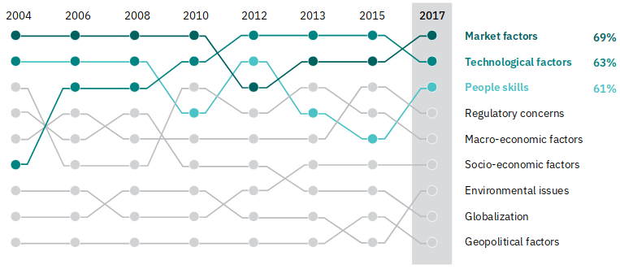

= Digital disruption origins, trends, impacts: An IBM Point-of-View
:date: 6-Apr-2018
:slide-background-video: stars.webm
:_title-slide-background-video: stars.webm
:title-slide-background-image:  luddites.png
:_revealjs_center: false
:icons: font
:stem: latexmath

[.location]
*Frederico Muñoz* | Chief Architect | IBM Technical Expert Council (SPGI)
HUMANE Spring Seminar
Aveiro | April 2018

[.big]
== Hello!

== !
image::https://avatars0.githubusercontent.com/u/285727?s=460&v=4[width="150", border="0"]

icon:envelope-o[] <frederico.munoz@pt.ibm.com>

icon:linkedin[] https://www.linkedin.com/in/fsmunoz/

icon:twitter[] https://twitter.com/fredericomunoz

icon:github[] https://github.com/fsmunoz

== About the Technical Expert Council

The Technical Expert Council for Spain, Portugal, Greece and Israel is
an affiliate of the IBM Academy of Technology.

image::https://researcher.watson.ibm.com/researcher/images/aotlogo_100x100.png[width=20%,role=inline] 

[.bigger]
== Disruption

== !

Since 2000, *52%* of companies in the Fortune 500 have either gone
bankrupt, been acquired or ceased to exist.

[background-image=blade-runner.jpg]
== !
(and it started before that...)

== a quick look at some of today's industries...
== !

[%step]
* World's largest taxi company owns no cars (Uber)
* Largest accomodation provider owns no  realestate (Airbnb)
* Largest phone companies own no telco infra (Skype, WeChat)
* World's most valubable retailer has no inventory (Alibaba)

== !
[%step]
* Most popular media owner creates no content (Facebook)
* Fastest growing banks have no actual money (SocietyOne)
* World's largest movie house owns no ciname (Netflix)
* Largest software vendors don't write the apps (Google and Apple)

[.reference]
IBM for Entreperneurs, Sandy Carter

== !

Digitalisation changed things drastically

[.big]
== How did we get here?

== a quick journey through some milestones

[background-image=https://fronteffects.files.wordpress.com/2014/04/tron-disneyscreencaps-com-7858.jpg]
== !
[%step]
* 1972: Pulsar, the world's first all-electronic digital watch and the first to use a digital display, is launched.
* 1975: The first digital camera, invented by Steven Sasson at Eastman Kodak, takes 23 seconds to capture its first image. 
* 1977: Citibank installs its first ATM. 
* 1982: The movie Tron is released.

== !
[%step]
* 1982: The first commercial compact disc (CD) is produced,
* 1985: Whole Earth’s ‘Lectronic Link (WELL) established, one of the first “virtual communities.”

[background-image=https://d2c85jgx6ttczr.cloudfront.net/assets/import/2017/05/o-ZX-SPECTRUM-facebook.jpg]
== around this time I was also starting out...

[background-image=https://cleaner.ansilove.org/artwork/cl!-ppcm.ans.png]
== ... and latter getting grounded due to a huge phone bill.

[background-image=https://blog.sciencemuseum.org.uk/wp-content/uploads/2017/08/WWW.jpg]
== !
[%step]
* 1991:                                       The first 2G cellular network is launched in Finland.
* 1992:                              Tim Berners-Lee posts the first photo uploaded to the Web,
* 1994:                    A large pepperoni, mushroom and extra cheese pizza from Pizza Hut is ordered online, possibly the first transaction on the Web.
* 1998:                                       Digital Television transmission commences in the U.K. and the U.S

[background-image=film.jpg]
== !
[%step]
* 2002:                                       Digital information storage surpasses non-digital for the first time.
* 2003:                                       More digital cameras than traditional film cameras are sold in the U.S. for the first time.
* 2003:                            The DVD format (launched in the late 1990s) becomes more popular than VHS in the U.S.
* 2008:                                       More music is sold by iTunes than by Wal-Mart.

[background-image=press.jpg]
== !
[%step]
* 2011:                                       Amazon.com sells more Kindle books than print books.
* 2014:                                       Streaming revenue from services like Spotify and Pandora overtake CD sales for the first time.
* 2015                                       Every minute, Skype users make 110,040 calls, Twitter users send 347,222 tweets, YouTube users upload 300 hours of new videos, Pinterest users pin 9,722 images, Netflix subscribers stream 77,160 hours of video, Snapchat users share 284,722 snaps, and Facebook users like 4,166,667 posts.

== Key factors that fueled disruption

[background-video="./clouds.mp4",options="loop,muted"]
[.big]
== Cloud

== !
"By 2020, businesses without cloud capabilities will be as uncommon as
businesses without Internet are today. 30 percent of the largest new
software investments will exist entirely on the cloud"
-- Gartner 

[.big]
== Rise of mobile

== !
[%step]
* Always-on expectation
* Interaction through mobile
* Restructuring of social life

[background-image=twin.png]
== Internet of Things

== !
* Universal connectivity
* Sensors everywhere
* Huge ammount of data being generated
* Ability to map the physical world to the digital model

== !

[.big]
== So-called _disruptors_ took full advantage of these

== !
* "Digital first" culture competitors
* Perceived the rise of different customer interaction models
* Were able to explore new markets

==  !

"As different as these new disruptors are from one another,
they all display the ability to leverage digital technologies to
understand the customer, sense market shifts, and innovate faster than
the competition."
-- Harvard Business Report 2016

[.big]
== No industry is immune

== Financial sector

== !
* ATMs are ubiquitous - but being replaced by cashless operations via mobile.
* An onslaught of digital invaders like Simple, Tesco Bank, PayPal, Square, Alibaba.com, etc.
* The need for speed and innovation pose a constant challenge when catering to an ever younger Digital generation.

== !
[.bigquote]
"80% of CXOs are experimenting with different business models or
thinking of doing so, using cloud for innovation."
-- Robert Leblanc, Senior Vice President, IBM Cloud,

== Insurance

== !
* Rapid digitisation and changing customer demographics are putting
immense pressure on the insurers today and making them rethink the way
they run the insurance industry.
* Millennials, have already taken over the baby boomers and now make up a
quarter of the UK population (Inkling Millenial Report 2015).
* Almost 20% of millennials say they would buy insurance from
Google since they are easier to reach (IBM Institute of
Business Value study)

== Automotive industry

== !
* The connected car and IoT
* Autonomous driving
* Mobile devices as the main form of interaction

== !
[.bigquote]
"The fear of OEMs is that a car will become a
smartphone on wheels, with cars built around their entertainment value
rather than their hardware value."
-- Paul Fielden (IBM Automotive Global Center of Competence Lead)

[.big]
== There is a direct impact in terms of the social fabric and work relations

== !
[.bigquote]

"According to our estimates, about 47 percent of total US employment is at
risk. We further provide evidence that wages and educational attainment
exhibit a strong negative relation-ship with an occupation’s
probability of computerisation"
-- Frei and Osborne, University of Oxford

[background-image=http://idora.milliyet.com.tr/MolaSlider/2017/12/26/fft351_mf26404884.Jpeg]
==  When one body exerts a force on a second body, the second body simultaneously exerts a force equal in magnitude and opposite in direction on the first body.

[background-image=luddites.png]
== !
[.bigquote]

"The sole cause of great riots was the new machines employed in cotton
manufacture; the country notwithstandinghas greatly benefited from
their erection [and] destroying them in this countrywould only be the
means of transferring them to another [. . . ]to the detriment of the
trade of Britain"
-- ibid, (cited in Mantoux, 2006, p. 403).

== !

(but just like then, people are not scared of technology: they're
scared of instability)

== Analogs vs Digitals

== !

From the HBR study:

* A cement company invested in analytics.
* An hospitality company invested heavily in analytics and in people
  skilled in analysing digital trends.
* Pharma companies are analysing data to track usage.

== Out with old, in with the new?

[background-image="https://cdn.vox-cdn.com/uploads/chorus_image/image/44154932/cdn.indiewire.0.0.jpg"]
[.big]
== The Incumbents Strike Back

== !

What’s required, now more than ever, is the fortitude for perpetual reinvention.

[background-color="white"]
== !
[.stretch]

== Dancing with disruption

Seventy-two percent of C-suite executives tell us that innovative
industry incumbents lead the disruption in their industry

[.big]
== What changed?

== One wave of disruption may be abating.

[%step]
* Ubiquitous mobility and digital media have already shaken up the most
susceptible industries.
* The number of business startups in the United States recently reached a 40-year low.
* Incumbents honed their skills to acquire nascent disruptors, along
  with their digital skills and innovator talent.
  

[.big]
== On skills
[.bigquote]
"Since electrification, the story of the twentieth century has been the race between education and technology"
-- Goldin and Katz (2009)

== Disruption without startups

* Disruption hasn’t gone underground. Instead, it’s emerging as a
capability incumbents are ready to embrace.
* Innovation is no longer the province of the hungry upstart. 

[.big]
== The path to personalization

== !

_In three sectors alone – retail, healthcare and financial services –
personalization will drive a revenue shift of USD 800 billion to the
15 percent of companies that get it right._

== From getting the data to using the data

== !

_Discriminant analysis of C-suite executives’ responses to our
questions reveals that one factor, more than any other, distinguishes
the leaders – the Reinventors – from other organizations. It is the
capacity to use data to identify unmet customer needs._

== AI and the search for effective personalisation

== !

* AI used to get better understanding of customer needs
* Cognitive solutions adopted to improve customer experience

== !

_As design thinkers, Reinventors are always on the hunt for new clues
that reveal customer needs. Over one-quarter of Reinventors turn to
artificial intelligence technologies and cognitive solutions to better
understand customers and improve the customer experience_

[.big]
== Orchestrating the future

== !

On average, platform orchestrators grow revenues faster and generate
higher profits than other business models, earning market valuations
as high as eight times revenue

== How to do it?

== !
[%step]
* *Create value from reciprocity* – Adopt a deeply collaborative
   approach that spans an ecosystem to create win-win propositions
* *Capitalize on data* – Cultivate and orchestrate data as their most
   important asset to hone performance and the capacity for continuous
   change
* *Commit to innovation* – Reallocate capital and resources from
   defending markets to innovating in new ones.

== Cooperation and competition

== !
The biggest step change between Platform Builders and the Platform
Operators that already have platforms in place is their *attitude
toward competitors*.

== !

_Six of Canada’s leading banks – the Bank of Montreal, Canadian
Imperial Bank of Commerce, Desjardins Group, Royal Bank of Canada,
Scotiabank and TD Bank – came together to establish a digital identity
verification service on a blockchain platform._

== Capitalise on data

[%step]
* be open to mutual advantage
* double down on data

== Commit to inovation

== !
Those who’ve already established a platform model are allocating on
average 9.0 percent of their capital toward it.

[.big]
== Innovation in motion

== !
Cultivating autonomy and continuous learning by implementing a more
fluid work structure made up of cross-functional teams.

== Becoming agile

== !
[%step]
* *Dynamic vision*: understanding where the industry is heading, promote
  transparency and dialogue with employees, clearly express the
  overall company vision.
* *Open culture* : promote active employee participation, empower teams, promote collaboration and knowledge sharing.
* *Agile operations*: invest in continuos employee skills development,
   reward both fast failure and sucessful innovation, adopted a fluid
   work structure built on cross-functional teams.

[.big]
== Actions to take now

== Interrogate your environment

[%step]
* Remain on high alert and avoid complacency about past successes.
* Design and play a new offense.
* Get ever closer - to everyone involved.

== Commit with frequency
[%step]
* Divest to invest.
* Invest for new growth.
* Prioritize advocacy and co-creation over advertising.

== and by the way

[background-image=https://res.cloudinary.com/uktv/image/upload/v1372867533/ou70cqjaugarnjvy3xi0.jpg]
== that's commit, not a committe.

== Experiment deliberately

[%step]
* Seek innovation over institutionalization.
* Write new rules.
* Find energy in motion.

== (IBM adopted this as well)

[background-iframe=https://www.ibm.com/design/thinking/]
[.big]
== !

== Architect for disruption

* Relentlessly reduce unit IT costs by putting the right workload on
  the most suitable best-fit infrastructure.
* Easily and securely store, process and find value in a continuous
  volume of structured and unstructured data.
* Continually improve and personalize user experiences by infusing
  artificial intelligence (AI) and machine learning (ML) technologies.
* Rapidly design, deploy and maintain your new transformative
  applications.

== but there's something beyond digital disruption

[.big]
[background-image=neurons.mp4]
== Cognitive disruption

== We've mostly talked about impact of digitalisation and computerisation in routine tasks

[.big]
== But we're beyond that

== we've already seen how important is...
[background-image=https://images.pexels.com/photos/239898/pexels-photo-239898.jpeg]
[.bigger]
== Data

[.big]
== Lots of data

== The advances in AI and cognitive computing put them to good use

== !

* Understand – images, language and other unstructured data.
* Reason – by comprehending domain-specific concepts, forming hypotheses and
  inferring and extracting ideas.
* Learn – by developing and sharpening expertise with each new data
  point, interaction and outcome.
* Interact – with employees and policyholders in a natural way that
  allows cognitive solutions to dissolve barriers between humans and
  machine.

== !

"...within the next couple of decades, AI has a high likelihood of
automating 70% of today’s jobs in the energy sector, and 65% of
today’s jobs in consumer staples..."
-- PwC

== ... and thus bringing automation to non-routine cognitive tasks as well.

[.big]
== What the future holds?

[background-image="http://web.eecs.umich.edu/~profmars/wp-content/uploads/2014/10/SHORPY_00529u1-1080x380.jpg"]
== IBM Research 5 in 5

[background-image=blockchain-stop.jpg]
== Blockchain

== !

Within the next five years, cryptographic anchors and blockchain
technology will ensure a product’s authenticity -- from its point of
origin to the hands of the customer.

[background-image=leadspace-large.jpg]
== Security & Cryptography

== !

The scale and sophistication of cyber-attacks escalates every year, as
do the stakes. In five years, new methods of attack will make today’s
security measures woefully inadequate.

[background-image=ocean-stop.jpg]
== AI, robots and the oceans

== !

In five years, small autonomous AI microscopes, networked in the cloud
and deployed around the world, will continually monitor the condition
of the natural resource most critical to our survival: water.

[background-image=illustration-net.png]
== AI bias

== !

Within five years, the number of biased AI systems and algorithms will
increase. But we will deal with them accordingly – coming up with new
solutions to control bias in AI and champion AI systems free of it.

[background-image="http://research.ibm.com/ibm-q/images/card-360.jpg"]
== Quantum computing

In five years, the effects of quantum computing will reach beyond the
research lab. It will be used extensively by new categories of
professionals and developers looking to this emerging method of
computing to solve problems once considered unsolvable.

[.big]
== and what about education?

== !
* Khan Academy started as a Youtube playlist, now offers structured
  online courses.
* edX, Coursera and other MOOCs are increasingly popular (and have content by HE institutions)
* Some have their own platforms (e.g. MIT OpenCourseware)
* Huge pressure from industry in terms of skills
* Changing expectations and behaviour from students

[.big]
== Will this shift the focus away from existing Higher Education institutions?

== probabily not

== !

* Recognition
* Students are not customers
* Teaching is not selling

== still, some aspects to consider

[.big]
== IBM's PoV: Education in the Cognitive Era

[background-iframe=https://www.ibm.com/watson/education]
== !

== !
[%step]
* Personalised teaching strategies.
* Use what mobile connectivity offers in a way that is aligned with
  pedagogical principals.
* Make life easier - for students and faculty - by providing better,
  more actionaly insights.
* Use digital disruption to better align with the industry in terms of
  needed skills.

== !
* Infuse technology in new ways to transform individualized learning.
* Engage everyone in paving a better path to the future
* Embrace new technology  at your own pace.
* Help those who teach and those who learn.
* Promote a lifelong journey.

== one focus of tension

[.big]
== Prepare informed citizens, or prepare ready-to-employ workers?

[background-image="theschoolboy.jpg"]
== !

[.big]
== Thank you!

== References

[.tiny]

* Cover image: Luddites smashing a loom, from https://en.wikipedia.org/wiki/Luddite#/media/File:FrameBreaking-1812.jpg[Wikipedia]
* Cover image from Greek vase from https://www.studenthandouts.com/01-Web-Pages/01-Picture-Pages/09.03-Blue-Ancient-Greek-Classical-Education.htm[Student Handouts] (cf. FURTWÄNGLER, A.; REICHHOLD, K. Griechische Vasenmalerei, vols. I-III. 1904)
* "The Empire Strikes Back" image from https://www.polygon.com/2014/11/14/7222237/this-modern-empire-strikes-back-trailer-is-just-fantastic[Polygon]. THE EMPIRE STRIKES BACK TM & © 1980 Lucasfilm Ltd. (LFL) All rights reserved.
* AI in Insurance data from https://www.ibm.com/blogs/insights-on-business/insurance/artificial-intelligence-machine-learning-insurance-industry/[Artificial intelligence and machine learning – Is this the next big disruption in the insurance industry?]
== References

* https://www.ibm.com/services/insights/c-suite-study/19th-edition:[Global C-suite Study: Incumbents Strike Back], IBM Institute for Business Value
* https://www.forbes.com/sites/gilpress/2015/12/27/a-very-short-history-of-digitization[A Very Short History of Digitization], Gil Press, Forbes.
* Gartner data on cloud from https://www.ibm.com/blogs/cloud-computing/2017/02/01/cloud-digital-disruption/[Cloud digital revolution: Disrupt or be disrupted]
* https://www-01.ibm.com/common/ssi/cgi-bin/ssialias?htm[Watson Education PoV]
