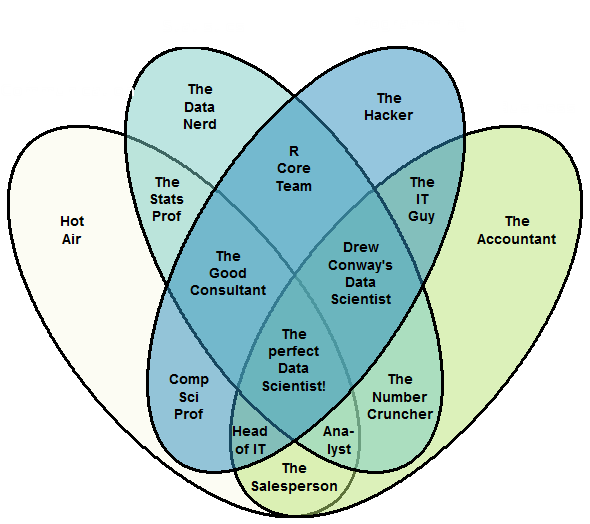

= IA e Data Science na IBM: Conceitos, soluções e uma visão para GTS.
:date: 21-10-2019
:slide-background-video: ../videos/stars.webm
:_title-slide-background-video: ../videos/stars.webm
:title-slide-background-image: north_pole.png
:icons: font
:email: <frederico.munoz@pt.ibm.com>

[.location]
*Frederico Muñoz* | Chief Architect | IBM Technical Expert Council (SPGI)
GTS Talks
Lisbon | Fevereiro 2020

== !
image::https://avatars0.githubusercontent.com/u/285727?s=460&v=4[width="150", border="0"]

icon:envelope-o[] <frederico.munoz@pt.ibm.com>

icon:linkedin[] https://www.linkedin.com/in/fsmunoz/

icon:twitter[] https://twitter.com/fredericomunoz

icon:github[] https://github.com/fsmunoz

== Ligação para esta apresentação:

 

== Sobre o Technical Expert Council

O Technical Expert Council para Espanha, Portugal, Grécia e Israel é
um organismo afiliado da IBM Academy of Technology.

image::https://researcher.watson.ibm.com/researcher/images/aotlogo_100x100.png[width=20%,role=inline] 

[.bigger]
== História

O caminho que fizemos

[.big]
== através de momementos fundamentais da IBM Research nos campos da IA e Investigação Cognitiva

[.bigger]
== 1954

[.big]
== Mark I and Mark II Automatic Language Translators

[transition=zoom]
== !

* Tradução automática de Russo para Inglês, começando por 250 palavras e tradução de textos de química orgânica.
* Em 1960 o vocabulários é de 170 000 palavras em vários domínios.

== IBM Harvard Mark I
[.stretch]
video::77Bvz4qZ_Rw[youtube, start=10, options=autoplay]

[.bigger]
== 1958

== Efeito túnel

A descoberta de Leo Esaki da junção de semicondutor chamada de diodo
de Esaki tem influência crucial no desenvolvimento da electrónica.

[.bigger]
== 1959

[.big]
== Arthur Lee Samuel

[background-image=https://www-03.ibm.com/ibm/history/ibm100/images/icp/A138918I23240Y22/us__en_us__ibm100__700_series__checkers__620x350.jpg]
== !

[.big]
== Checkers Player

== !

* Primeiro programa de Damas que demonstra a capacidade de um
  computador aprender através da experiência.

[.bigger]
== 1967

[background-image=http://1.bp.blogspot.com/-0RDVXPxVh-g/U0xE4ANp3LI/AAAAAAAAABc/kJfowUD4Dnc/s1600/6.gif]
== Geometria fractal

IBM, researcher *Benoît Mandelbrot*.

[.big]
== Robert Mercer

[background-image=https://researcher.watson.ibm.com/researcher/files/us-bbfinkel/robert_mercer.jpg]
== !

[.big]
== Reconhecimento de Voz Probabilístico

== !

* A IBM desenvolve a abordagem fundamental ao *reconhecimento de voz
  probabilístico* baseado em ideas da Teoria da Informação.

[.bigger]
== 1969

== Missões Apollo

[background-iframe=https://www.ibm.com/thought-leadership/the-apollo-missions/]
== !

[background-video="../videos/moon.mp4",options="loop,muted"]
[.big]
== !

[.bigger]
== 1984

[.big]
== Reconhecimento de voz em tempo real

== !

* Primeira demonstração de reconhecimento de voz em tempo real com largo vocabulário.
* Avanço fundamental no reconhecimento de voz em termos de eficácia, precisão e validade do modelo.

[.bigger]
== 1985

[.big]
== Raciocínio limitado

[.big]

== Fangin & Halpern

== !

* Novas lógicas de conhecimento assentes em agentes que não são loicamente omniscientes.
* Importante pois permite a contrução de modelos mais próximos do
  raciocínio limitado, e assim mais próximos do pensamento humano.

[.bigger]
== 1988

[.big]
== Tradução estatística entre línguas

[background-image=https://upload.wikimedia.org/wikipedia/commons/d/d7/IBM_models_03.jpg]
== !

== !

* Marco na criação de estratégias de ensino a máquinas par a tradução automática entre duas linguas.
* Assente Modelos Ocultos de Markov.

[.bigger]
== 1992

[.big]
== Gerald Tesauro

[background-image=https://researcher.watson.ibm.com/researcher/files/us-bbfinkel/gtesauro_ai_350.jpg]
== !

[.big]
== TD-Gammon

== !
[%step]
* Aproximação não-linear e *aprendizagem por reforço*.
* Aplicada ao Gamão por um programa que aprendeu sozinho.
* Com esforço mínimo atingiu e ultrapassou o nível de mestres humanos.

[.bigger]
== 1995

[.big]
== Pensando sobre o Conhecimento

== Ronald Fagin, Joseph Y. Halpern, Yoram Moses, Moshe Vardi.

== !

* Um trabalho base para a discussão sobre o pensamento, conhecimento e
  as aplicações da Inteligência Artificial e teoria de jogos.
* Transformar o resultado de oito anos de trabalho numa plataforma
  coerente para a análise e compreensão do temo do _conhecimento_
  matematicamente fundamentada, intuitiva e genericamente aplicável.
  
[.bigger]
== 1997

[background-image=https://images.theconversation.com/files/168950/original/file-20170511-32613-1ipnlda.jpg?ixlib=rb-1.1.0&rect=0%2C49%2C2048%2C993&q=45&auto=format&w=1356&h=668&fit=crop]
[.big]
== Deep Blue Chess

Primeiro computador a derrotar um Campeão do Mundo de Xadrez, Garry Kasparov.

[.bigger]
== 2002

[.big]
== BLEU: Bilingual Evaluation Understudy

== !

* Método de tradução automática
* Rápido, barato, independente da linguagem, com elevada correlação com os resultados humanos.

[.bigger]
== 2009

[.big]
== UIMA: Unstructured Information Management

==  Apache UIMA Project Team

== !
[%step]
* Unstructured Information Management Architecture (UIMA)
* Standard OASIS desde Março de 2009.
* Foi fundamentalpara o avanço da manipulação de informação
  não-estruturada que é tipicamente texto mas pode conter datas,
  números e factor.

[.bigger]
== 2009

[.big]
== Mais Statistical Machine Translation

== Salim Roukos

== !

* Sequência de cinco modelos usados para estimar o alinhamento entre palavras de um texto base e uma frase alvo.
* Estes modelos são conhecidos na literatura científica como "Modelos IBM de alinhamento".

[.bigger]
== 2013

[background-image="../images/nanomovie.jpg"]
== A Boy and His Atom

Um tipo diferente de "curta metragem".

[background-video="../videos/boy.mp4",options="loop,muted"]
[.big]
== !

== ... e muitos outros

[.small]
*1947*  Magnetic Core Memory  *1957*  Landauer Formalism - Conductance must come in Quantized Units
*1958*  Quantum Tunnelling *1960* Thin Film Heads
*1966*  Tunable Lasers *1966*  Two-Dimensional Electron Gas (2DEG)
*1967*  Josephson Junctions *1968*  DRAM - 1 Transistor RAM
*1974*  Dennard Scaling (aka Why Moore's Law also speeds up transistors in Lay Terms) *1978*  Scanning Tunneling Microscope (1986 Nobel Prize Winner)
*1982*  Thermodynamics of Computation *1983*  High Temperature Superconductors (1987 Nobel Prize Winner)
*1990*  Moving Atoms *1991*  RFID
*1993*  Quantum Teleportation *1993*  Seminal Contributions to the Theoretical Foundation of Quantum Information Processing
*1994*  High-Speed Silicon-Germanium Electronics *1997*  GMR - Giant Magnetoresistive Heads
*1998*  Copper Interconnect *2002*  SOI: Silicon on Insulator
*2002*  Theory of Nanoscale Material *2007*  High-K Gate Dieletric
*2008*  Racetrack Memory *2008*  Cooling 3D Chips
*2011*  Non-Planar Devices *2012*  Holey Optochip - 1 Terabit per Second Optical Bus
*2013*  Millimeter Wave

[.bigger]
== Em 2011, um passo fundamental

==  Watson and Jeopardy!

[background-iframe=https://www.youtube.com/embed/P18EdAKuC1U?autoplay=1]
== !

== !
[%step]
* Primeiro computador a derrotar campeões de Jeopardy!
* Utilizou mecanismos cognitivos para compreender, pesquisar, contruir uma resposta e exprimi-la.

[.bigger]
== Project Debater

== O primeiro sistema de IA a debater tópicos complexos com humanos

[background-iframe=https://www.youtube.com/embed/FmGNwMyFCqo?autoplay=1]
== !

== ... e disponível para todos testarem

[background-iframe=https://ces.debater-event.us-south.containers.appdomain.cloud/#/]
== !

[.bigger]
== Conceitos

AI, Machine Learning, Cognitive...

[background-color="white"]
== !
[.stretch]
image::../images/the-new-technologies.jpg[width=100%,role=inline]

== Aprendizagem por máquinas

* Capacidade de computadores aprenderem com novos dados.
* Algoritmos que aprendem com dados e permitem estabelecer previsões
ou outras capacidade com base nessa aprendizagem.

== Inteligência Artificial

* Com base em informação, capacidade de tomar decisões e acções que
  melhor se adequem a um determinado contexto.

== Computação cognitiva

* Sistemas que interagem naturalmente com pessoas.

[transition=zoom, %notitle]
== !

e podemos utilizá-los?

[.big]
== Muitos deles, sim.

== Tecnologia e soluções da IBM, muitas delas _open source_.

== !
A sua utilização em GTS depende também (ou sobretudo) de cada um

[transition=zoom, %notitle]
== As várias dimensões de _Data Science_

== !

[bigger]
== Recursos gerais

== Cognitive Class

- Utilização gratuíta
- Da IBM mas assente completamente em _software_ livre
- Utilização para fins educativos

[background-iframe=https://cognitiveclass.ai/]
== !

== ... e com acesso a muitas ferramentas

https://labs.cognitiveclass.ai/

[transition=zoom, %notitle]
[.big]
== Algumas recomendações

== !

- https://cognitiveclass.ai/learn/data-science[Data Science Foundations]

== Data Science Foundations

- Jupyter Notebooks
- Zeppelin Notebooks
- RStudio

== !
https://cognitiveclass.ai/learn/data-science-with-python[Applied Data Science with Python]

== Applied Data Science with Python

- Pandas
- SciPy
- scikit-learn
- Matplotlib
- Seaborn
- Folium

== !
https://cognitiveclass.ai/learn/deep-learning[Deep Learning]

== Deep Learning

- Tensorflow

[transition=zoom, %notitle]
[.big]
== IBM Coursera

https://w3.ibm.com/w3publisher/training/blog/77798140-bccd-11e9-bb6d-f15467bce838[Announcing NEW Artificial Intelligence Courses on Coursera]

== Acesso a...

- https://www.coursera.org/professional-certificates/applied-artifical-intelligence-ibm-watson-ai?utm_source=IBM&utm_medium=institutions&utm_campaign=PcertAI[IBM Applied AI Professional Certificate]
- https://www.coursera.org/professional-certificates/ai-engineer?utm_source=IBM&utm_medium=institutions&utm_campaign=PcertAIeng[IBM AI Engineering Professional Certificate]
- https://www.coursera.org/specializations/ibm-ai-workflow[IBM AI Enterprise Workflow Specialization]

[transition=zoom, %notitle]
[.big]
== Watson Data Platform

- A solução da IBM para a gestão de todos os aspectos de um projecto em
_Data Science_ e IA.
- Inclui muitos dos componentes já vistos, integrando-os numa oferta de nível empresarial.

https://dataplatform.cloud.ibm.com/home?context=wdp

[transition=zoom, %notitle]
[.big]
== Comunidades e recursos internos

== Cognitive@IBM

"Learn about what other teams are doing with cognitive, build your own
solutions using the Watson services in Bluemix, and discuss your ideas
with our team of cognitive experts."

[background-iframe=https://cognitive-ibm.w3ibm.mybluemix.net/#/]
== !

== AI Academy

== !

"Artificial intelligence is changing every profession in every
company. The only way to think about the future is to think about it
with AI. If we want to see the full potential for AI and use
technologies to bring about the best in each of us, we must reinvent
education and skills. The opportunity is here. Invest in your skills
and continuous learning journey by being a part of the IBM AI Skills
Academy."

https://ai-academy.w3bmix.ibm.com/

== Cognitive Academy

== !

"Learn, share, and engage with us to help build a more cognitive enterprise."

https://cognitive-academy.w3ibm.mybluemix.net/#!/

[transition=zoom, %notitle]
== Watson Analytics

[background-image=../images/watson_analytics.jpg]
== !

== (lembram-se?)

[background-image=../images/RIP.jpg]
== ! 

== ... mas como é frequente...

[background-image=../images/thriller.gif]
== !

== Cognos Analytics

- Acesso para todos os IBMers (fase piloto?)

https://zcogcad.boulder.ibm.com/transform/cognitive/bi/?perspective=home

[transition=zoom, %notitle]
== IBM Data Science Community

https://community.ibm.com/community/user/datascience/communities/community-home?CommunityKey=f1c2cf2b-28bf-4b68-8570-b239473dcbbc[Comunidade pública sobre Data Science]

[background-iframe=https://community.ibm.com/community/user/datascience/communities/community-home?CommunityKey=f1c2cf2b-28bf-4b68-8570-b239473dcbbc]
== !

== Data Science Community Europe

https://community.ibm.com/community/user/datascience/communities/community-home?CommunityKey=f1c2cf2b-28bf-4b68-8570-b239473dcbbc

[background-iframe=https://community.ibm.com/community/user/datascience/communities/community-home?CommunityKey=f1c2cf2b-28bf-4b68-8570-b239473dcbbc[IBM Data Science Community]
== !

== AI Academy

https://ai-academy.w3bmix.ibm.com

[background-iframe=https://ai-academy.w3bmix.ibm.com/]
== !

[transition=zoom, %notitle]
[.big]
== E mais especificamente em GTS?

== Agile Accelerate GTS Delivery: Data Science Guild

"The Europe Data Science Guild is a community whose goal is to guide
and advise the Data Analysts which are part of Tribes, in order to
help them performing their duties."

== !

- EU Data Science Guild Slack Channel: #gts-Europe-data-science-guild

== Educação específica para soluções de GTS

- https://ec.yourlearning.ibm.com/w3/series/10059291?other=All&track=All%20Tracks&layout=grid[GTS Europe Data Science Guild Education]

== Agile Accelerate GTS Delivery

https://w3.ibm.com/w3publisher/agile-accelerate-gts-delivery

[background-iframe=https://w3.ibm.com/w3publisher/agile-accelerate-gts-delivery]
== !

[transition=zoom, %notitle]
== Em resumo

- Existem várias formas de aprofundar o conhecimento nestas áreas.
- A sensibilização para o que é possível fazer pode levar à aplicação
  de novas soluções para velhos problemas em GTS.
- Numa fase inicial depende sobretudo de cada um fazer uso das
  possibilidades existentes.
- Existem projectos em curso para estruturar a participação em GTS.

[.big]
== Obrigado

[.bibliography]
== Additional information

* https://www.ibm.com/watson/health/[Watson Health: Cognitive Healthcare Solutions], landing page.
* https://www.youtube.com/IBMWatsonHealth[IBM Watson Health videos], Youtube channel.
* https://www-935.ibm.com/services/us/gbs/thoughtleadership/drhealthcare/[A healthy outlook: Digital Reinvention in healthcare], IBM Institute for Business Value study on disruption in healthcare.
* https://www.ibm.com/blogs/policy/trust-principles/[IBM’s Principles for Trust and Transparency]

== !

* http://www.research.ibm.com/history/[History of Progress: IBM Research]
* https://www.youtube.com/watch?v=OxpuU6baGqY[IBM Centennial Film: They Were There - People who changed the way the world works]
* https://www.ibm.com/blogs/watson-health/watson-health-get-facts/[Watson Health: Get the Facts], overview of advances and application of Watson in the healthcare domain, updated and with references.

== !

* http://myemail.constantcontact.com/IBM-Watson-Health-Scientific-Update-Year-in-Review.html?soid=1129673529564&aid=f5zyPh1LeMI[Introducing the Watson Health 100: Scientific Update Year in Review], curated scientific update "year in review" featuring the top 100 studies.
* http://myemail.constantcontact.com/IBM-Watson-Health-Scientific-Update--Q1-2018-.html?soid=1129673529564&aid=xVnu-QTiSSA[2018 Q1 Watson Health Scientific Update]
* http://myemail.constantcontact.com/IBM-Watson-Health-Scientific-Update--Q2-2018.html?soid=1129673529564&aid=2dTK9ByyOj8[2018 Q2 Watson Health Scientific Update]

