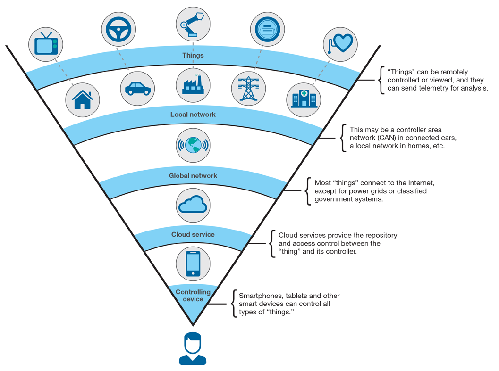

= IBM IoT Factory: apresentação, motivação, direcção.
:date: 10-Set-2018
:slide-background-video: stars.webm
:_title-slide-background-video: stars.webm
:_title-slide-background-image: stars.png
:_revealjs_center: false
:icons: font
:stem: latexmath

[.location]
*Frederico Muñoz* | Chief Architect | IBM Technical Expert Council (SPGI)
Apresentação interna para novas contratações
IBM Portugal | Setembro 2018

== IoT Factory...

[.big]
== Porquê?
[.stretch]

[.bigger]
== Internet of Things

[.big]
== Conetividade

==  (de forma segura)

[.big]
== Armazenamento dos dados

==  (também de forma segura)

[.bigger]
== Chega?

[.big]
== para a IBM é o início

== A grande questão...
[.bigger]
== O que fazer com os dados?

== alguns exemplos

[.big]
== The Weather Company

[.big]
[background-image=https://www-03.ibm.com/press/us/en/attachment/50220.wss?fileId=ATTACH_FILE2&fileName=IBM&TWCPWS.png]
==  20 milhões de fontes de dados

== !

Toda a informação recolhida, normalizada e preparada para análise.

== Com objetivos concretos.

[.big]
[background-video="./weather.mp4",options="loop,muted"]
== Construir melhores modelos preditivos.

== um outro exemplo

[.big]
[background-image=https://www.ibm.com/cognitive/uk-en/outthink/img/lh_aviation_outthink_1920px.jpg]
== Aviação com Watson

== cada avião contém milhares de sensores

== !

(mais de 10.000 em cada asa!)

[background-video="./airtraffic.mp4",options="loop,muted"]
== (e são milhares de aviões em milhares de rotas)

== !

todos estes dados recolhidos permitem-nos compreender e atuar sobre algo conhecido de todos...

[.big]
[background-image=https://media.giphy.com/media/3owvKgRjmrtgJikO7C/giphy.gif]
== Turbulência

== !

(mais do que uma questão de conforto, causa de milhões em custos operacionais e de manutenção)

[background-iframe=https://www.youtube.com/embed/kQIkqD8pd-I?autoplay=1]
== !

[.big]
== A IoT é um ponto de partida 

== !
* Inteligência Artificial
* Cloud
* Mobile
* APIs e Microserviços
* Blockchain

== Esta capacidade única de integração que permite ir mais além

[bbackground-video="./neurons.mp4",options="loop,muted"]
[.big]
==  e criar assistentes de IA para a Internet das Coisas

[background-iframe=https://www.youtube.com/embed/UkZJHVzVW-U?autoplay=1]
== !

== A plataforma IBM IoT permite

== !

* Ligar
* Misturar
* Agregar
* Explorar
* Gerir

[.big]
[background-image=leadspace-large.jpg]
== Preservando a privacidade e transparência para com os detentores dos dados.

[background-color=white]
== Uma arquitetura flexível e aberta
[.stretch]
image::./architecture_platform_2.svg[]

[bbackground-image=https://i.pinimg.com/originals/a8/e2/25/a8e225f40b2ef5beb6860a70da4f188d.jpg]
[background-video="./tjbot.mp4",options="loop,muted"]
[.big]
== com capacidade de análise e reação na periferia

[.big]
[background-video="./clouds.mp4",options="loop,muted"]
== ... e sempre disponível na IBM Cloud.

== Só esta combinação permite ir além do «em tempo real»...

[background-video="./powerboat.mp4",options="loop,muted"]
== !

**E permite reagir ao que ainda**

**se vai passar**

[background-image=../images/vitruvius_ideal_rv_bw.jpg]
[.big]

== com o IoT vem também

[background-image=../images/vitruvius_ideal_rv_bw.jpg]
[.big]

== A Cidade

== (e as Cidades Inteligentes)

[background-image=../images/vitruvius_ideal_rv.jpg]
== Dados e Conhecimento
[.bigquote]
"...The architect should be equipped with knowledge of many branches
of study and varied kinds of learning, for it is by his judgement that
all work done by the other arts is put to test..."
-- Vitruvius (de arch. 2.1.1)

[background-image=../images/pexels-photo-239898.jpeg]
[.big]
== As cidades são fontes de imensos dados

== (Internet das Coisas numa escala urbana)

[background-color="white"]
== !
[.stretch]

== Muitas das vezes temos os dados...

[.big]
== ... mas o que podemos fazer com eles?

[background-video="./neurons.mp4",options="loop,muted"]
== Data Science, Machine Learning

[.bigger]
== e Inteligência Artifical

[background-image=../images/vitruvius_ideal_rv.jpg]
== Dados e Conhecimento
[.bigquote]
"...all that is greatest and essential is under the direction of the
thinking power of the mind and the understanding..."
-- Vitruvius (de arch. 6.0.3)

== Algumas definições.

== !
[.bigquote]
"At its core, data science is applying the scientific method to solve business problems."
-- Seth Dobrin & Jean-François Puget (IBM)

== Analytics

[%step]
* «The scientific process of transforming data into insight for making better decisions» (INFORMS)

== Inteligência Artifical
"By AI we mean anything that makes machines act more intelligently"
-- IBM Research AI Research Group

== Tanto em termos de abordagens clássicas

[background-image=https://images.theconversation.com/files/168950/original/file-20170511-32613-1ipnlda.jpg?ixlib=rb-1.1.0&rect=0%2C49%2C2048%2C993&q=45&auto=format&w=1356&h=668&fit=crop]
[.big]
== Deep Blue Chess

== como as que mais recentemente acabaram com o "Inverno da IA"

[background-image=https://n1s1t23sxna2acyes3x4cz0h-wpengine.netdna-ssl.com/wp-content/uploads/2017/09/watson_on_jeopardy.jpg]
[.big]
== Watson Jeopardy! Challenge

== Numa cidade tudo isto pode ser aplicado em diferentes escalas

[.big]
== para a construção de um Planeta Inteligente
[background-iframe=https://www.youtube.com/embed/pkBwB8ofcXI?autoplay=1]
== !

[background-image=../images/vitruvius_ideal_rv.jpg]
== Incluíndo logística e distribuição
[.bigquote]

"...and selecting a neighbourhood that can supply plenty
of food stuffs to maintain the community, with good roads or else
convenient rivers or seaports affording easy means of transport to the
city..."
-- Vitruvius (de arch. 2.5.1)

== pois as cidades são também grandes centros de produção e transporte

[.big]
[background-image=../images/news-transport-jan18-portofrotterdam.jpg]
== Porto de Roterdão

== !

[%step]
 * 140 000 ships/year
 * 42 km port area
 * 90 000 people employed
 * 3.3% of Dutch GDP

[background-image=../images/port_digital.png]
== !

[background-image=../images/twin.png]
== !

[%step]
 * *Digital twin*
 * *Weather data integration*
 * *Digitisation*
 * *Operational improvements*

== Isto explica também porque a aquisição que a IBM fez

[background-image="http://www.slate.com/content/dam/slate/blogs/moneybox/2015/10/29/2015-ibm-weather-company-logo-clouds.jpg.CROP.promo-xlarge2.jpg"]
== !

== !
(a maior rede de IoT do mundo)

[.big]
== Porque as Cidades Inteligentes são compostas de _locais inteligentes_.

[background-image=../images/vitruvius_ideal_rv.jpg]
== Construção vertical
[.bigquote]

"...The accommodations within the city walls being thus multiplied as
a result of the many floors high in the air, the Roman people easily
find excellent places in which to live..."
-- Vitruvius (de arch. 2.8.17)

[background-image="https://www.ibm.com/watson/assets/duo/img/hero/hero-kone2.jpg"]
== !
A billion people a day. Millions of elevators. No room for downtime

[background-iframe=http://machineconversations.kone.com]
== !

[background-image=../images/vitruvius_ideal_rv.jpg]
== A localização e a mobilidade
[.bigquote]
"First comes the choice of a very healthy site"
-- Vitruvius (de arch.2.4.1)

== !
pois as cidades mudam com o tempo

[background-image=../images/antonino.png]
== Novas rotas para novas centralidades

== Utilizamos o IoT como meio para ajudar a transformar a cidade

[background-image=../images/ioc_tub.png]
== !

== !

integrando múltiplas fontes de dados em tempo real

[background-image=../images/iot_tub.png]
== !

== !

e as soluções necessárias para analisar os dados

[background-image=../images/watson_tub.png]
== !

[background-image=../images/muralha_romana_medieval.JPG]

== No fundo, o verdadeiro desafio

[background-image=https://ebooks.adelaide.edu.au/l/literature/science-and-literature-in-the-middle-ages/images/fig049.jpg]
[.big]
== é usar IA, IoT e Computação Cognitiva para a melhoria das cidades e da vida dos cidadãos.

[background-image="../images/castelo_guimaraes.jpg"]
== E em Portugal?

== !

* Vídeo-vigilância
* Hospitais
* Indústria
* Contadores
* Estacionamento

== !

* Torres
* Logística
* Transportes
* Retalho
* Cidades Inteligentes
* Connected Cars

== É necessário conseguir construir soluções para as oportunidades existentes

== !

IoT, AI, Machine Learning, Cloud, Data Science...

== !
[.stretch]

== !

[%step]
* Transversal às Unidades (GTS, GBS, Cloud,  SW...)
* Multi-disciplinar por natureza
* Foco na solução

== Tecnologias

Python, Cisco IoS, Clojure, IBM Maximo, Java, Node-RED, Javascript,
DB2, Openwhisk, Watson Analytics, Grafana, VMware, GNU/Linux, bash,
node.js, Dojo, CouchDB, Intelligent Operations Center, SPSS, Watson
Studio, C, Dojo, CPLEX, Watson IoT Platform, Kubernetes, Kapua, MQTT,
Cognos, R, IBM Cloud, Kura, Cisco IOX...

[.big]
== Para a IBM

[background-video="./IBM_PoR.mp4",options="loop,muted"]
== desde a criação de um gémeo digital de um dos maiores portos do mundo
(com a sensorização em ambiente terreste e aquático e determinação das melhores rotas)

[background-video="./ibm-rhinos.mp4",options="loop,muted"]
[.big]
== até à proteção dos rinocerontes africanos de caçadores furtivos
(usando dados de sensores na fauna local)

[background-video="./moon.mp4",options="loop,muted"]
== O limite é, hoje como ontem, a nossa capacidade de imaginar o futuro.

[.big]
== Obrigado!
image::https://avatars0.githubusercontent.com/u/285727?s=460&v=4[width="150", border="0"]

icon:envelope-o[] <frederico.munoz@pt.ibm.com>

icon:linkedin[] https://www.linkedin.com/in/fsmunoz/

icon:twitter[] https://twitter.com/fredericomunoz

icon:github[] https://github.com/fsmunoz

