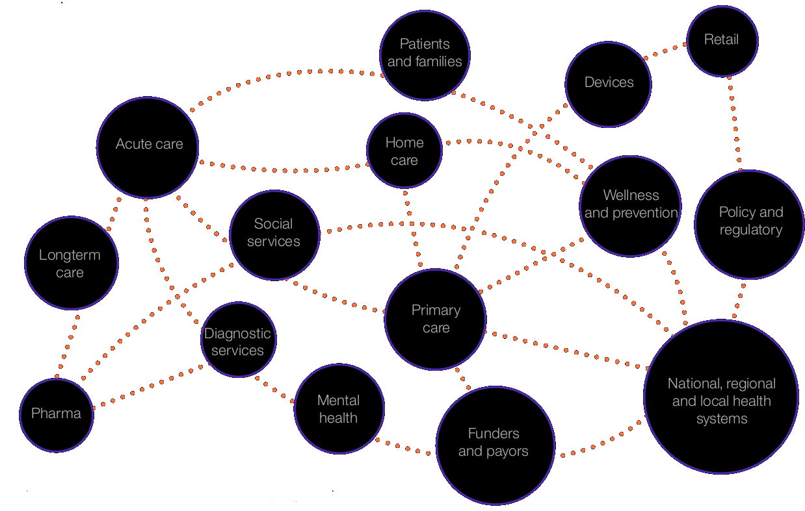

= Watson for Health: Artificial Intelligence in Life Sciences & Healthcare
:date: 14-Set-2018
:slide-background-video: stars.webm
:_title-slide-background-image: cover_bg.png
:icons: font
:email: <frederico.munoz@pt.ibm.com>

[.location]
*Frederico Muñoz* | Chief Architect | IBM Technical Expert Council (SPGI)
Pfizer Townhall Talks
Lisbon | September 2018

[.big]
== Hello!

== !
image::https://avatars0.githubusercontent.com/u/285727?s=460&v=4[width="150", border="0"]

icon:envelope-o[] <frederico.munoz@pt.ibm.com>

icon:linkedin[] https://www.linkedin.com/in/fsmunoz/

icon:twitter[] https://twitter.com/fredericomunoz

icon:github[] https://github.com/fsmunoz

== About the Technical Expert Council

The Technical Expert Council for Spain, Portugal, Greece and Israel is
an affiliate of the IBM Academy of Technology.

image::https://researcher.watson.ibm.com/researcher/images/aotlogo_100x100.png[width=20%,role=inline] 

[.bigger]
== Disruption

== !

Since 2000, *52%* of companies in the Fortune 500 have either gone
bankrupt, been acquired or ceased to exist^1^.

[.copyright]
Ray Wang, Cloud Is The 'Foundation For Digital Transformation, Forbes 2014.

== a quick look at some of today's industries...

== !

* World's largest taxi company owns no cars (Uber)
* Largest accommodation provider owns no  real-estate (Airbnb)
* Largest phone companies owns no telco infra (Skype, WeChat)
* World's most valubable retailer has no inventory (Alibaba)

== !

* Most popular media owner creates no content (Facebook)
* Fastest growing banks have no actual money (SocietyOne)
* World's largest movie house owns no cinema (Netflix)
* Largest software vendors don't write the apps (Google and Apple)

[.copyright]
Sandy Carter, "IBM for Entrepreneurs"

== Digitalisation changed things drastically

[.big]
== How did we get here?

== a quick journey through some milestones

[background-image=https://fronteffects.files.wordpress.com/2014/04/tron-disneyscreencaps-com-7858.jpg]
== !

* 1972: Pulsar, the world's first all-electronic digital watch and the first to use a digital display, is launched.
* 1975: The first digital camera, invented by Steven Sasson at Eastman Kodak, takes 23 seconds to capture its first image. 
* 1977: Citibank installs its first ATM.
* 1977: Apple ][
* 1981: IBM PC
* 1982: The movie Tron is released.

[.copyright]
Gil Press, "A Very Short History of Digitization", Forbes.
Tron is © 1982 The Walt Disney Company

== !

* 1982: The first commercial compact disc (CD) is produced.
* 1985: Whole Earth’s Electronic Link (WELL) established, one of the first “virtual communities.”

[background-image=https://upload.wikimedia.org/wikipedia/commons/thumb/3/33/ZXSpectrum48k.jpg/1280px-ZXSpectrum48k.jpg]
[.big]
== (around this time I was also starting to be interested in computing)

[background-image=https://blog.sciencemuseum.org.uk/wp-content/uploads/2017/08/WWW.jpg]
== !

* 1991: The first 2G cellular network is launched in Finland.
* 1992: Tim Berners-Lee posts the first photo uploaded to the Web.
* 1994: A large pepperoni, mushroom and extra cheese pizza from Pizza Hut is ordered online, possibly the first transaction on the Web.
* 1998: Digital Television transmission commences in the U.K. and the U.S

[.copyright]
NeXT Station image: CC BY-NC-SA © The Board of Trustees of the Science Museum, London|CERN 

[background-image="../images/film.jpg"]
== !

* 2002: Digital information storage surpasses non-digital for the first time.
* 2003: More digital cameras than traditional film cameras are sold in the U.S. for the first time.
* 2003: The DVD format (launched in the late 1990s) becomes more popular than VHS in the U.S.
* 2008:                                       More music is sold by iTunes than by Wal-Mart.

[background-image="../images/press.jpg"]
== !

* 2011: Amazon.com sells more Kindle books than print books.
* 2014: Streaming revenue from services like Spotify and Pandora
  overtake CD sales for the first time.
* 2015: Every minute, Skype users make 110,040 calls, Twitter users
  send 347,222 tweets, YouTube users upload 300 hours of new videos,
  Pinterest users pin 9,722 images, Netflix subscribers stream 77,160
  hours of video, Snapchat users share 284,722 snaps, and Facebook
  users like 4,166,667 posts.

[.copyright]
_ Impressio Librorum_ © The Trustees of the British Museum; photograph, J.R. Freeman & Co. Ltd.

== Key factors that fueled disruption

[background-video="../videos/clouds.mp4",options="loop,muted"]
[.big]
== Cloud

== !
"By 2020, businesses without cloud capabilities will be as uncommon as
businesses without Internet are today. 30 percent of the largest new
software investments will exist entirely on the cloud"
-- Gartner 

[.big]
== Rise of mobile

== !
[%step]
* Always-on expectation
* Interaction through mobile
* Restructuring of social life

[background-image=https://upload.wikimedia.org/wikipedia/commons/c/c3/Internet_map_4096.png]
[.big]
== Internet of Things

== !
* Universal connectivity
* Sensors everywhere
* Huge ammount of data being generated
* Ability to map the physical world to the digital model

[.big]
== So-called _disruptors_ took full advantage of these

== !
* "Digital first" culture competitors
* Perceived the rise of different customer interaction models
* Were able to explore new markets

[.big]
== No industry is immune

== Financial sector

== !
* ATMs are ubiquitous - but being replaced by cashless operations via
  mobile.
* An onslaught of digital invaders like Simple, Tesco Bank, PayPal,
  Square, Alibaba.com, etc.
* The need for speed and innovation pose a constant challenge when
  catering to an ever younger Digital generation.

== !
[.bigquote]
"80% of CXOs are experimenting with different business models or
thinking of doing so, using cloud for innovation."
-- Robert Leblanc, Senior Vice President, IBM Cloud,

== Automotive industry

== !
* The connected car and IoT
* Autonomous driving
* Mobile devices as the main form of interaction

== !
[.bigquote]
"The fear of OEMs is that a car will become a
smartphone on wheels, with cars built around their entertainment value
rather than their hardware value."
-- Paul Fielden (IBM Automotive Global Center of Competence Lead)

[.bigger]
== What about Healthcare?

[background-image=https://www-935.ibm.com/services/us/gbs/thoughtleadership/images/healthcare_banner.jpg]
== !

"Global healthcare is experiencing dramatic and remarkable
change. New and emerging technologies – such as AI, cognitive
computing, IoT, Cloud and 3D printing, among many others – are
converging to change not only how, where and with what precision
healthcare is delivered, but also the very definition of healthcare."
-- A Healthy Outlook: Digital Reinvention in Healthcare, IBM Institute
for Business Value

== Once a series of fragmented activities

== !

...healthcare is evolving into integrated ecosystems of researchers, providers, payers and regulators that can interact with patients, caregivers and others on an individualized basis.

== !

 

== !

* 43% of surveyed healthcare executives say boundaries between their
industry and others are blurring
* 54% of surveyed healthcare.  executives report that traditional
industry value chains are being replaced with new value models.
* 51% of surveyed healthcare 
executives say competition is coming
from new and unexpected places.

[.copyright]
A healthy outlook: Digital Reinvention in healthcare] IBM Institute for Business Value.

== Technological advancements are helping healthcare to become more personalized, more cost-effective and scalable

== !

...while the availability of skilled and semi-skilled healthcare
workers is projected to decline significantly due to changing social
demographics and rapidly evolving technologies

== a key driver of this change

[background-image=https://images.pexels.com/photos/239898/pexels-photo-239898.jpeg]
[.bigger]
== Data

[.big]
== (lots of data)

== !

* Human Genome of a single oncology patient: half a Terabyte.
* Number of hours to keep up with medical literature: ~160.

== The advances in AI and cognitive computing make use of this data

[background-video="../videos/neurons.mp4"]
== !

* Understand – images, language and other unstructured data.
* Reason – by comprehending domain-specific concepts, forming hypotheses and
  inferring and extracting ideas.
* Learn – by developing and sharpening expertise with each new data
  point, interaction and outcome.
* Interact – with employees and policy holders in a natural way that
  allows cognitive solutions to dissolve barriers between humans and
  machine.

== A breakthrough: Watson and Jeopardy!

[background-iframe=https://www.youtube.com/embed/P18EdAKuC1U?autoplay=1]
== !

== !

* First computer to defeat TV game show Jeopardy! champions.
* Research teams are working to *adapt Watson to other information-intensive fields*, such as telecommunications, financial services... and *healthcare*

== Watson Health: from concepts to outcomes

== !

* Watson for Genomics
* Watson for Oncology
* Watson for Clinical Trial Matching
* Watson for Drug Discovery
* Watson for Care Management

== !

IBM *Watson for Genomics* helps analyze a patient’s tumor's
  genomic data by providing information on potential therapeutic
  options with supporting evidence.
  

== Precision Medicine
The New York Genome Center and Watson Health

[background-iframe=https://www.youtube.com/embed/K9URgz7V9_0?autoplay=1]
== !

== Understanding unstructured data

*Watson for Oncology* _consumes_ the growing body of medical
  literature, guidelines, trials, articles, and patient data,
  _interprets_ medical records and _recommends_ potential courses of
  action.

== Manipal Hospitals: a case study

[background-iframe=https://www.youtube.com/embed/fAiRqM44hgM?autoplay=1]
== !

== Pfizer and Watson for Drug Discovery

*Watson for Drug Discovery* reveals connections and relationships
 among genes, drugs, diseases and other entities by analyzing multiple
 sets of life sciences knowledge. Researchers can generate new
 hypotheses using the resulting dynamic visualizations and
 evidence-backed predictions.

[background-iframe=https://www.youtube.com/embed/kHOh-zD5TWg?autoplay=1]
== !

== !

*Watson Care Manager* helps organizations unlock and integrate the
 full breadth of information from multiple systems and care providers,
 automate care management workflows, and scale to meet the demands of
 growing populations under management.

[background-iframe=https://www.youtube.com/embed/ihy-BO-NfoU?autoplay=1]
== !

== !

*Watson for Clinical Trial Matching* enables clinicians to more
easily and quickly find a list of clinical trials for an eligible
patient. Similarly, it enhances the ability of clinical trial
coordinators to find patients that are potentially eligible for any of
the site’s trials
 
[background-iframe=https://www.youtube.com/embed/grDWR7hMQQQ?autoplay=1]
== !

== Artificial Intelligence and us 

[background-image=https://nit.pt/wp-content/uploads/2017/03/metropolis-754x394.jpg]
== Are we "being replaced"?

== Is Watson Health a replacement for MDs and other Health and Life Sciences professionals?

[.big]
== No

== IBM's Principles for Trust and Transparency

== !

* The purpose of AI is to *augment human intelligence*.
* Data and insights belong to their creator.
* New technology, including AI systems, must be transparent and explainable.

[background-image="../images/leadspace-large.jpg"]
== !

Watson Health solutions make *recommendations*, provides *focused and
relevant information* to healthcare professionals, which are ultimately
the ones making decisions, determining care, prescribing treatments, etc.

== !

in many ways

[background-image=https://robohub.org/wp-content/uploads/2016/08/bigstock-Man-and-robot-meet-and-handsha-127357220.jpg]
== Watson Health enables us to give the best of ourselves.

[.big]
== Thank you!

