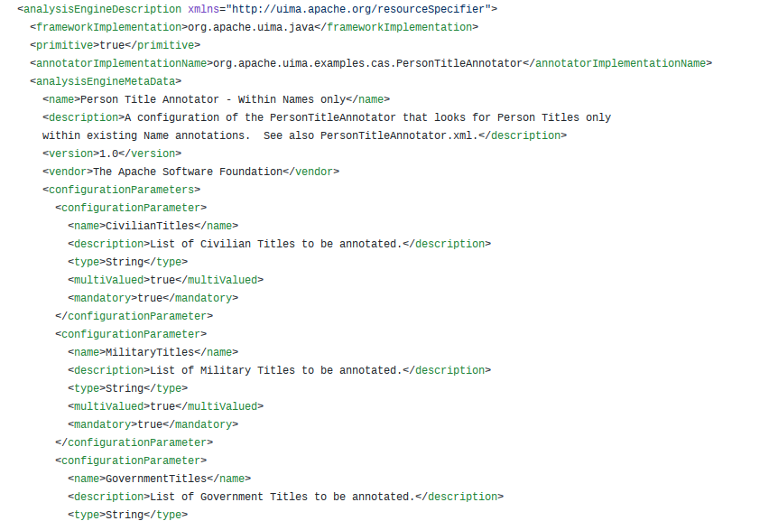
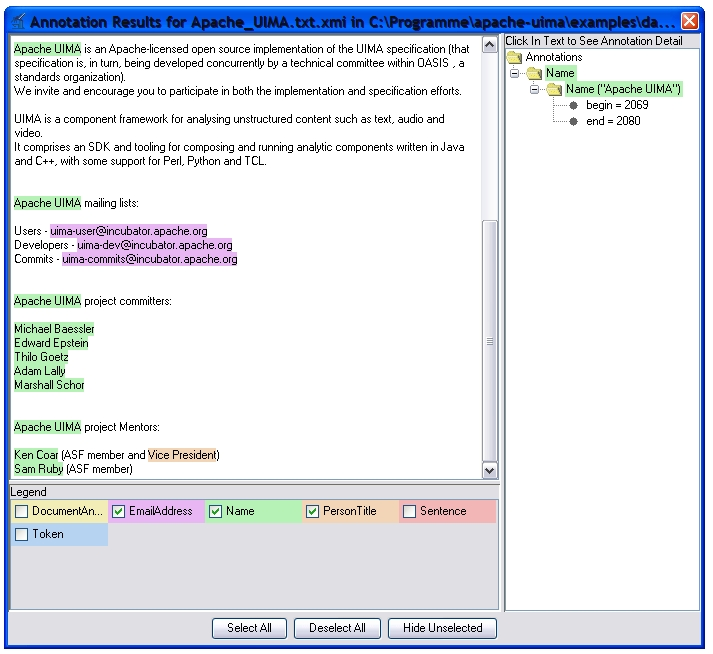
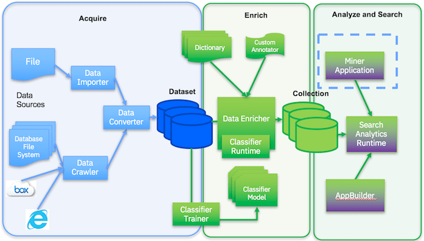

= Dialogue response and processing: Resources and tools
:date: 2-Out-2018
:slide-background-video: stars.webm
:title-slide-background-image: ../images/leadspace-large.jpg
:icons: font
:email: <frederico.munoz@pt.ibm.com>

[.location]
*Frederico Muñoz* | Chief Architect | IBM Technical Expert Council (SPGI)
TechLING, Universidade Autónoma de Lisboa
Lisbon | October 2018

[.big]
== Hello!

== !
image::https://avatars0.githubusercontent.com/u/285727?s=460&v=4[width="150", border="0"]

icon:envelope-o[] <frederico.munoz@pt.ibm.com>

icon:linkedin[] https://www.linkedin.com/in/fsmunoz/

icon:twitter[] https://twitter.com/fredericomunoz

icon:github[] https://github.com/fsmunoz

== About the Technical Expert Council

The Technical Expert Council for Spain, Portugal, Greece and Israel is
an affiliate of the IBM Academy of Technology.

image::https://researcher.watson.ibm.com/researcher/images/aotlogo_100x100.png[width=20%,role=inline] 

==  Dialogue response, conversation and NLP are hot topics.

== !

We've been working on them for quite some time now.

[.big]
== let's catch up with some history.

[.big]
== with some highlights of IBM Research in the field.

[.bigger]
== 1954

[.big]
[background-iframe=https://www.youtube.com/embed/77Bvz4qZ_Rw?autoplay=1&start=10]
== Mark I and Mark II Automatic Language Translators

[transition=zoom]
== !

* Automatic translators from Russian to English, starting with a
250-word vocabulay, translated organic chemistry texts.
* 1960s: the Mark II had a 170,000-word vocabulary and
could cover a wide domain.

[.bigger]
== 1959

[.big]
== Arthur Lee Samuel

[background-image=https://www-03.ibm.com/ibm/history/ibm100/images/icp/A138918I23240Y22/us__en_us__ibm100__700_series__checkers__620x350.jpg]
== !

[.big]
== Checkers Player

== !

* First checkers program to demonstrate that computers can learn
from experience.
* Used techniques such as mutable evaluation
functions, hill climbing, and signature tables to explore rote and
generalization learning. 

[.bigger]
== 1961

== IBM Shoebox

Developed by William C. Dersch at IBM's Advanced Systems Development
Division Laboratory in San Jose, Calif.

== !

a forerunner of today's voice recognition systems, it performed
arithmetic on voice command.

[background-iframe=https://www.youtube.com/embed/rQco1sa9AwU?autoplay=1]
== !

[.bigger]
== 1972

[.big]

[background-image=https://researcher.watson.ibm.com/researcher/files/us-bbfinkel/robert_mercer.jpg]
== Robert Mercer

[.big]
== Probabilistic Speech Recognition

== !

* IBM developed the core approach to *probabilistic speech recognition* based on ideas from Information Theory.
* Applied *Information Theory* and probabilistic understanding instead of linguistic understanding.

[.bigger]
== 1984

[.big]
== Real-time Speech Recognition

== !

* First real-time demonstration of a large vocabulary *speech recognition dictation system*.
* Major advance in speech recognition -- accuracy and fundamental underlying model.

[.bigger]
== 1985

[.big]
== Limited Reasoning

[.big]

== Fangin & Halpern

== !

* Introduced and studied several new logics for
belief and knowledge, all of which held that agents are not *logically
omniscient*.

[.bigger]
== 1988

[.big]
== Statistical Translation Between Languages

[background-image=https://upload.wikimedia.org/wikipedia/commons/d/d7/IBM_models_03.jpg]
== !

== ! 
* Major advance in teaching a machine how to translate one human language into another.
* Used alignment and Hidden Markov Models.

[.bigger]
== 1992

[.big]
== Gerald Tesauro

[background-image=https://researcher.watson.ibm.com/researcher/files/us-bbfinkel/gtesauro_ai_350.jpg]
== !

[.big]
== TD-Gammon

== !
[%step]
* Nonlinear function approximation and *Reinforcement Learning*.
* Neural net trained by a form of temporal-diference learning (TD).
* Tested in Backgammon by a self-learning program.
* With minimal search reached and surpassed human masters.

[.bigger]
== 1995

[.big]
== Reasoning about Knowledge

== Ronald Fagin, Joseph Y. Halpern, Yoram Moses, Moshe Vardi.

== !

* Provided a general discussion of approaches to reasoning about knowledge and its applications to distributed systems, artificial intelligence, and game theory.
* It brings eight years of work by the authors into a cohesive framework for understanding and analyzing reasoning about knowledge that is intuitive, mathematically well founded, useful in practice, and widely applicable.

[.bigger]
== 1997

[background-image=https://images.theconversation.com/files/168950/original/file-20170511-32613-1ipnlda.jpg?ixlib=rb-1.1.0&rect=0%2C49%2C2048%2C993&q=45&auto=format&w=1356&h=668&fit=crop]
[.big]
== Deep Blue Chess

First computer to defeat human World Chess Champion, Garry Kasparov.

[.bigger]
== 2002

[.big]
== BLEU: Bilingual Evaluation Understudy

== !
* Method of automatic machine translation evaluation.
* Quick, inexpensive, language-independent,  correlates highly with human evaluation, and has little marginal cost per run.

[.bigger]
== 2009

[.big]
== UIMA: Unstructured Information Management

==  Apache UIMA Project Team

== !
[%step]
* Unstructured Information Management Architecture (UIMA)
* OASIS standard as of March 2009.
* Signaled a major advance in handling real-world unstructured information, which is typically text-heavy, but may also contain dates, numbers and facts.

[.bigger]
== 2009

[.big]
== More Statistical Machine Translation

== Salim Roukos

== !
* Development of a series of steps to estimate more complex translation models from earlier easier -- and cruder -- translation models.
* A sequence of five models was used to estimate a word alignment between the words of a source and a target sentence.
* These models are referred to in the scientific literature as "IBM Model through IBM Model 5» .

[.bigger]
== 2011

== A breakthrough: Watson and Jeopardy!

[background-iframe=https://www.youtube.com/embed/P18EdAKuC1U?autoplay=1]
== !

== !
[%step]
* First computer to defeat TV game show Jeopardy! champions.
* Research teams are working to *adapt Watson to other information-intensive fields*

== !

Dialogue and conversation are essential areas for cognitive systems.

== !

== Some concepts: "unstructured content" and "annotations".

== !

Unstructured information management applications exist to analyse
large volumes of _unstructured data_ through a variety of analysis
techonologies.

== !

* Statistical and rule-based natural language processing (NLP)
* Information retrieval (IR)
* Machine learning
* Ontologies
* Automated reasoning
* Knowledge sources, for example, CYC, WordNet, or FrameNet

== !

[.quote]
"Unstructured Information Management applications are software systems
that analyze large volumes of unstructured information in order to
discover knowledge that is relevant to an end user.
-- Apache Foundation UIMA Project

== !

Developed by IBM, it was opened to the community and the
stewarship given to the Apache Foundation. It's an OASIS standard.

== !

* Enables applications to be decomposed into components, for example
  "language identification" => "language specific segmentation" =>
  "sentence boundary detection" => "entity detection (person/place
  names etc.)".

* Each component implements interfaces defined by the framework and
  provides self-describing metadata via XML descriptor files.

* Provides capabilities to wrap components as network services, and
  can scale to very large volumes by replicating processing pipelines
  over a cluster of networked nodes.

== !

Definitions are stored in XML files

[background-color="white"]
== !

== !

and used to annotate tokens

[background-color="white"]
== !

== Watson Explorer Content Analytics

* Collects and analyzes structured and unstructured content in
  documents, email, databases, websites, and other enterprise
  repositories
* Uses UIMA annotators
* Uses a "hypothesis free" approach by surfacing data and
  relationships that span both structured and unstructured data.

[background-color="white"]
== !

== !

"I WAS DRIVING MY 2005 FORD FREESTYLE AND HAD COME TO A COMPLETE
STOP. I HAD MY FOOT ON THE BRAKE. WHEN I TOOK MY FOOT OFF OF THE BRAKE
THE CAR SURGED FORWARD WITHOUT MY EVER HAVING TOUCHED THE
ACCELERATOR. I SLAMMED MY FOOT ON THE BRAKE TO AVOID HITTING THE CAR
AHEAD OF ME. MY CAR STALLED AND I WAS ABLE TO RESTART IT. THE CHECK
ENGINE LIGHT CAME ON. MY MECHANIC TOLD ME THAT THE THROTTLE BODY
NEEDED REPLACEMENT."

[background-iframe=https://www.ibm.com/cloud/garage/demo/try-watson-explorer/]
== !

== An example of discovery and dialogue in medicine.

The New York Genome Center and Watson Health

[background-iframe=https://www.youtube.com/embed/K9URgz7V9_0?autoplay=1]
== !

== Watson Discovery

* Embedded NLP
* Relevance Training
* Custom Model Annotation/Extraction

[background-iframe=https://www.ibm.com/watson/services/discovery-3/demo/index.html#demo]
== ! 

== Discovery is important to add to _conversations_ and produce a dialogue.

== Watson Assistant

* Create meaningful conversations
* Model natural conversation flows

== !

* Intents and entities, which you create to train Watson to understand meaningful examples

* Slots, which you use to capture context from a user to reduce redundancy

* Handlers, which you manage for users who go off topic

* Dialog flows, which you organize to lead users who digress from the
  conversation back to the original conversation

[background-iframe=https://www.ibm.com/cloud/garage/demo/try-watson-assistant/]
== !

== An example of Watson Assistant: booking a flight

link:++http://flight-booking-demo.mybluemix.net/?cm_sp=dw-bluemix-_-in-_-devcenter++[Booking demo]

[background-color="white"]
[background-iframe="http://flight-booking-demo.mybluemix.net/?cm_sp=dw-bluemix-_-in-_-devcenter"]
== !

== With this hability to dialogue we can add content mininging and exploration.

== Watson Expert Assist

== !

Dialogue with domain-specific catalogue and deep knowledge
discovery.

[background-iframe=https://www.ibm.com/cloud/garage/demo/try-watson-expert-assist/]
== !

== Machine Translation

* An area of focus for IBM for decades
* Many existing offerings from various companies
* Several open-source approaches available
* Different models used

== !

As mentioned, Statistic Machine Translation was something in which IBM
had a pioneering role and is still the mostly used model today.

[background-video="../videos/neurons.mp4"]
== !

IBM uses Neural Machine Translation (NMT) as the underlying model for
the Watson Translate technology, instead of SMT.

[background-image=https://cdn-images-1.medium.com/max/1600/1*XbWg1IhzkATeDJvSgRPRlw.png]
== !

[background-iframe=https://language-translator-demo.ng.bluemix.net/]
== !

== Natural Language Understanding

* Collection of APIs that offer text analysis through natural language processing.
* It can analyze text to help you understand its concepts, entities, keywords, sentiment, and more.
* Allows the creation of new models.

== !

https://natural-language-understanding-demo.ng.bluemix.net/

== Tone Analysis

== !

The IBM Watson Tone Analyzer service uses linguistic analysis to
detect emotional and language tones in written text. The service can
analyze tone at both the document and sentence levels.

== !

[.quote]
"To derive emotion scores from text, IBM Watson Tone Analyzer uses a
stackedgeneralisation-based ensemble framework to achieve greater
predictive accuracy [5].Features such as n-grams (unigrams, bigrams
and trigrams), punctuation, emoticons,curse words, greeting words
(such as “hello”, “hi” and “thanks”) and sentiment po-larity are fed
into machine learning algorithms to classify emotion categories."
-- MOSTAFA, Mohamed, et al. Incorporating emotion and personality-based analysis in user-centered modelling. In: International Conference on Innovative Techniques and Applications of Artificial Intelligence. Springer, Cham, 2016. p. 383-389.

== !

https://natural-language-understanding-demo.ng.bluemix.net/

== Speech is an aditional area with constant evolution

== !

And essential for cognitive systems

[background-iframe=https://www.youtube.com/embed/7qnd-hdmgfk?autoplay=1]
== !

== !

* Speech to Text: https://speech-to-text-demo.ng.bluemix.net/
* Text to Speech: https://text-to-speech-demo.ng.bluemix.net/

== Summing it up

== !

The evolution of computation and scientific knowledge in linguistics
are changing the way we interact with expert systems radically.

[.big]
[background-image=../images/ibm_old.jpg]
== Thank you!

[.bibliography]
== Additional information

* https://www.ibm.com/watson/health/[Watson Health: Cognitive Healthcare Solutions], landing page.
* https://www.youtube.com/IBMWatsonHealth[IBM Watson Health videos], Youtube channel.
* https://www-935.ibm.com/services/us/gbs/thoughtleadership/drhealthcare/[A healthy outlook: Digital Reinvention in healthcare], IBM Institute for Business Value study on disruption in healthcare.
* https://www.ibm.com/blogs/policy/trust-principles/[IBM’s Principles for Trust and Transparency]

== !

* https://www.noticiasaominuto.com/tech/771035/watson-o-medico-do-futuro-esta-a-caminho-de-portugal[Watson: O 'médico' do futuro está a caminho de Portugal],  Cristina Semião, Healthcare Manager IBM Portugal.
* https://expresso.sapo.pt/economia/2017-09-12-Saude-O-futuro-passa-pela-inteligencia-artificial-e-pelo-cruzamento-de-dados-dos-cidadaos#gs.m_BcRNs[Saúde: O futuro passa pela inteligência artificial e pelo cruzamento de dados dos cidadãos], Cristina Semião, Healthcare Manager IBM Portugal.

== !

* http://www.research.ibm.com/history/[History of Progress: IBM Research]
* https://www.youtube.com/watch?v=OxpuU6baGqY[IBM Centennial Film: They Were There - People who changed the way the world works]
* https://www.ibm.com/blogs/watson-health/watson-health-get-facts/[Watson Health: Get the Facts], overview of advances and application of Watson in the healthcare domain, updated and with references.

== !

* http://myemail.constantcontact.com/IBM-Watson-Health-Scientific-Update-Year-in-Review.html?soid=1129673529564&aid=f5zyPh1LeMI[Introducing the Watson Health 100: Scientific Update Year in Review], curated scientific update "year in review" featuring the top 100 studies.
* http://myemail.constantcontact.com/IBM-Watson-Health-Scientific-Update--Q1-2018-.html?soid=1129673529564&aid=xVnu-QTiSSA[2018 Q1 Watson Health Scientific Update]
* http://myemail.constantcontact.com/IBM-Watson-Health-Scientific-Update--Q2-2018.html?soid=1129673529564&aid=2dTK9ByyOj8[2018 Q2 Watson Health Scientific Update]

== References
[.tiny]
* https://blog.inten.to/in-january-2018-ibm-has-launched-their-neural-machine-translation-engine-in-a-preview-mode-b29f89877825
* https://www.ibm.com/blogs/watson/2018/07/improving-the-accuracy-speed-of-translations-with-neural-machine-translation/)
* MOSTAFA, Mohamed, et al. Incorporating emotion and personality-based analysis in user-centered modelling. In: International Conference on Innovative Techniques and Applications of Artificial Intelligence. Springer, Cham, 2016. p. 383-389.

* Sandy Carter in "IBM for Entrepreneurs", via https://www.siliconrepublic.com/companies/digital-disruption-changed-8-industries-forever[John Kennedy, Silicon Republic, "How digital disruption changed 8 industries forever"]
* https://www.forbes.com/sites/gilpress/2015/12/27/a-very-short-history-of-digitization[A Very Short History of Digitization], Gil Press, Forbes.
* Tron and the Tron movie © 1982 The Walt Disney Company
* ZX Spectrum image by Bill Bertram - Own work, CC BY-SA 2.5, https://commons.wikimedia.org/w/index.php?curid=170050[Wikipedia]
* NeXT Cube used by Tim Berners-Lee to design the World Wide Web at CERN, 1990, from http://collection.sciencemuseum.org.uk/objects/co8232360/next-cube-computer-1990-personal-computer[Science Museum], © The Board of Trustees of the Science Museum, London| CERN.
* Camera film wallpaper image from http://www.wallpapername.com/Body_Parts/hands/cityscapes_hands_film_negative_1920x1200_wallpaper_54156[Wallpapername].
* Impressio Librorum (Book Printing), plate 4 from the Nova Reperta (New Inventions of Modern Times), c. 1580–1605, engraving by Theodoor Galle after a drawing by Jan van der Straet, c. 1550; in the British Museum / Courtesy of the trustees of the British Museum; photograph, J.R. Freeman & Co. Ltd. https://www.britannica.com/technology/printing-press
* "Gartner Says By 2020, a Corporate "No-Cloud" Policy Will Be as Rare as a "No-Internet" Policy Is Today", https://www.gartner.com/newsroom/id/3354117[Gartner]
* https://www-935.ibm.com/services/multimedia/IBMCAI-Digital-disruption-in-automotive.pdf[Digital disruption and the future of the automotive industry], IBM.
* FREY, Carl Benedikt; OSBORNE, Michael A. The future of employment: how susceptible are jobs to computerisation?. Technological Forecasting and Social Change, 2017, 114: 254-280 (https://www.oxfordmartin.ox.ac.uk/downloads/academic/The_Future_of_Employment.pdf[pdf])
* https://www.ibm.com/services/insights/c-suite-study/19th-edition[Inside the Global C-suite Study]
