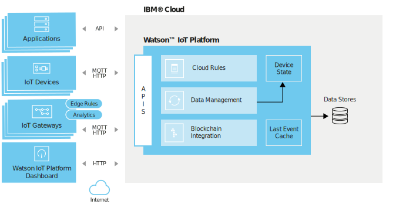

= THINK Lisboa: IoT, beyond connectivity and data
:date: 18-Jun-2018
:slide-background-video: stars.webm
:_title-slide-background-video: stars.webm
:_title-slide-background-image:  vitruvius_ideal_rv.jpg
:_revealjs_center: false
:icons: font
:stem: latexmath

[.location]
*Frederico Muñoz* | Chief Architect | IBM Technical Expert Council (SPGI)
THINK Lisboa
Convento do Beato | Junho 2018

[.bigger]
== Internet of Things

[.big]
== Conectivity

==  (in a secure way)

[.big]
== Data storage

==  (also securely)

[.bigger]
== Is that enough?

[.big]
== for IBM it is the beginning.

== The big question is...

[.bigger]
== What to do with the data?

== a couple of examples

[.big]
== The Weather Company

[.big]
[background-image=https://www-03.ibm.com/press/us/en/attachment/50220.wss?fileId=ATTACH_FILE2&fileName=IBM&TWCPWS.png]
==  20 million data sources

== !

All this information is gathered, stored, processed and analysed.

== With a purpose.

[.big]
[background-video="./weather.mp4",options="loop,muted"]
== To built better prediction models.

== another example

[.big]
[background-image=https://www.ibm.com/cognitive/uk-en/outthink/img/lh_aviation_outthink_1920px.jpg]
== Aviation with Watson

== each airplane contains thousands of sensors.

== !

(more than 10.000 in each wing!)

[background-video="./airtraffic.mp4",options="loop,muted"]
== and there are thousands of planes in thosands of routes, daily.

== !

all this data is used to understand and act upon something known to allof us...

[.big]
[background-image=https://media.giphy.com/media/3owvKgRjmrtgJikO7C/giphy.gif]
== Turbulence

== !

(more than a matter of confort, a cause of injuries and of millions in maintenance costs)

[background-iframe=https://www.youtube.com/embed/kQIkqD8pd-I?autoplay=1]
== !

[.big]
== IoT is a starting point

== !
* Artificial Intelligence
* Cloud
* Mobile
* APIs & Microservices
* Blockchain

== This is the unique integration ability that allows us to go further

[bbackground-video="./neurons.mp4",options="loop,muted"]
[.big]
== and create AI assistants for the Internet of Things

[background-iframe=https://www.youtube.com/embed/UkZJHVzVW-U?autoplay=1]
== !

== IBM IoT allows

== !

* Connect
* Mix
* Aggregate
* Explore
* Manage

[.big]
[background-image=leadspace-large.jpg]
== Preserving privacy and transparency with data owners.

[background-color=white]
== A flexivle and open architecture
[.stretch]

[bbackground-image=https://i.pinimg.com/originals/a8/e2/25/a8e225f40b2ef5beb6860a70da4f188d.jpg]
[background-video="./tjbot.mp4",options="loop,muted"]
[.big]
== with the ability to analise and act on the edge...

[.big]
[background-video="./clouds.mp4",options="loop,muted"]
== ... and always available on the IBM Cloud.

== Only this ability makes it possible to go beyond "real time"...

[background-video="./powerboat.mp4",options="loop,muted"]
== !

** and react to what is going to happen

[.big]
== Because for IBM

[background-video="./IBM_PoR.mp4",options="loop,muted"]
== From the creation of a digital twin of one of the world's biggest ports.
[background-video="./ibm-rhinos.mp4",options="loop,muted"]
[.big]
== to the protection of African rhinos from poachers

[background-video="./moon.mp4",options="loop,muted"]
== The limit is, now as before, our ability to imagine the future.

== And in Portugal?

== !

* Video survaillance
* Hospitals
* Industry
* Parking

== !

* Communication towers
* Logistics
* Transportation
* Retail
* Smarter Cities
* Connected Cars

== we are ready to surpass those limits with you.

[.big]
== Obrigado!
image::https://avatars0.githubusercontent.com/u/285727?s=460&v=4[width="150", border="0"]

icon:envelope-o[] <frederico.munoz@pt.ibm.com>

icon:linkedin[] https://www.linkedin.com/in/fsmunoz/

icon:twitter[] https://twitter.com/fredericomunoz

icon:github[] https://github.com/fsmunoz

